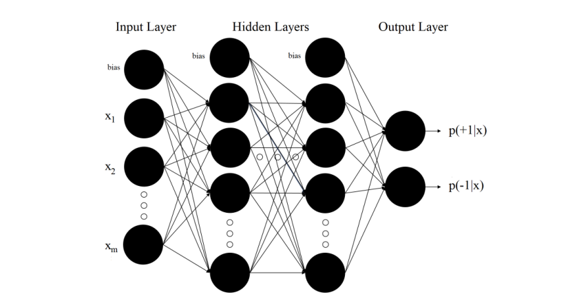
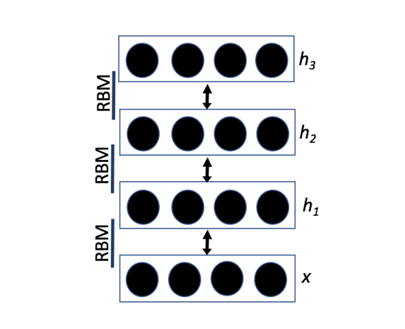
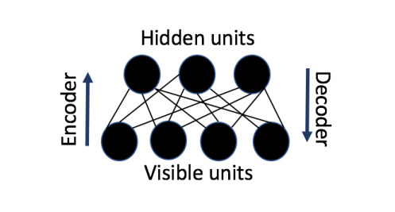
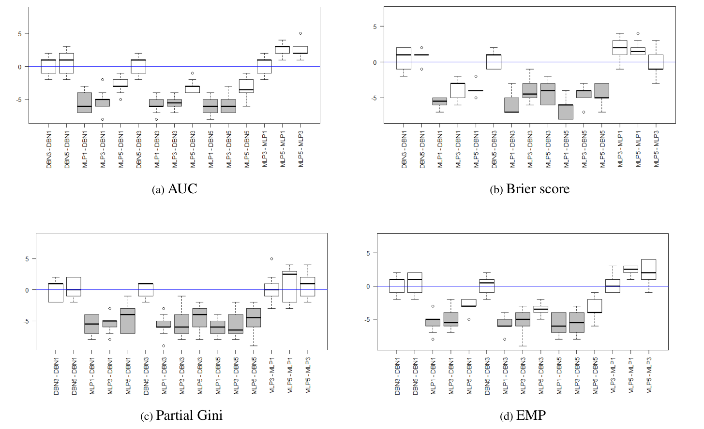
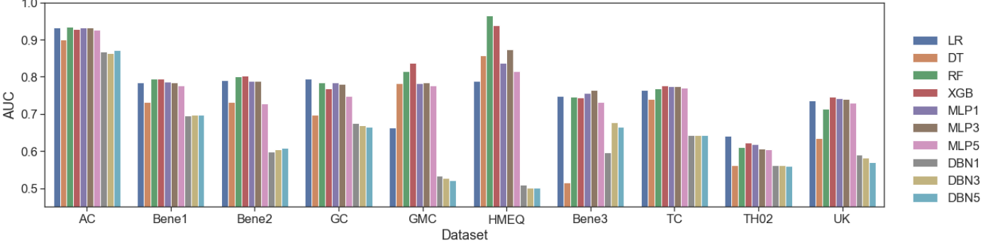
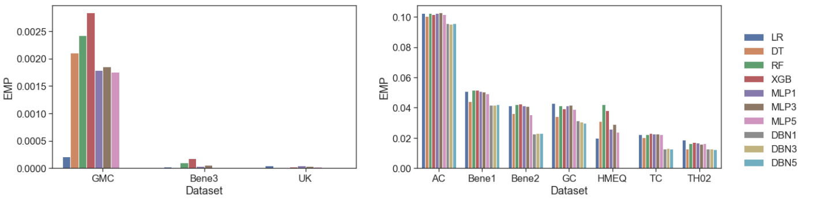
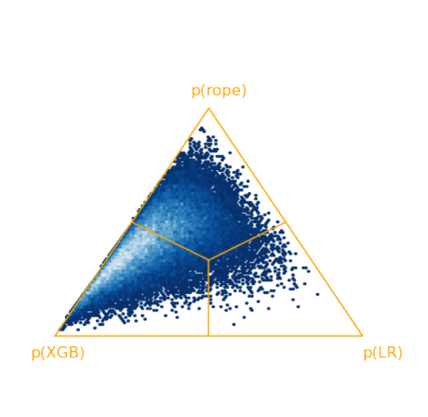

# Deep Learning for Credit Scoring: Do or Don’t?

**Björn Rafn Gunnarsson, Seppe vanden Broucke, Bart Baesens, María Óskarsdóttir, Wilfried Lemahieu**

Research Center for Information Systems Engineering (LIRIS), KU Leuven; Department of Business Informatics and Operations Management, Ghent University; Department of Decision Analytics and Risk, University of Southampton; Department of Computer Science, Reykjavík University.

> Preprint submitted to the *European Journal of Operational Research*, March 4, 2021.

## Abstract

Developing accurate analytical credit scoring models has become a major focus for financial institutions. For this purpose, numerous classification algorithms have been proposed for credit scoring. However, the application of deep learning algorithms for classification has been largely ignored in the credit scoring literature. The main motivation for this research is to consider the appropriateness of deep learning algorithms for credit scoring. To this end, two deep learning architectures are constructed, namely a multilayer perceptron network and a deep belief network, and their performance is compared with that of two conventional methods and two ensemble methods for credit scoring. The models are evaluated using a range of credit scoring data sets and performance measures. Furthermore, Bayesian statistical testing procedures are introduced in the context of credit scoring and compared with frequentist non-parametric testing procedures traditionally considered best practice in credit scoring. Two main conclusions emerge. First, the ensemble method XGBoost is the best-performing method of those considered. Second, deep neural networks do not outperform their shallower counterparts and are considerably more computationally expensive to construct. Therefore, deep learning algorithms do not appear to be appropriate models for credit scoring in this comparison, and XGBoost should be preferred when classification performance is the main objective.

**Keywords:** decision support systems; risk analysis; credit scoring; deep learning; Bayesian statistical testing

## 1. Introduction

Since the mid 20th century, both researchers and practitioners have put great emphasis on developing empirical models that assist retail lenders in the granting of credit to consumers. Today, commercial banks hold billions of dollars in consumer loans and the consumer credit sector has become a huge industry that is of substantial economic importance. The large volume of these loans illustrates that even small improvements in the accuracy of credit scoring practices can result in considerable financial gains. Developing accurate credit scoring models has therefore become a major focus for financial institutions in order to optimize profits and effectively manage risk exposures (Thomas et al., 2002; Lessmann et al., 2015; Board of Governors of the Federal Reserve System, 2019; Baesens et al., 2003; Jiang et al., 2019; Luo et al., 2017). Historically, managers often evaluated a consumer’s credit based on their intuitive experience. However, with the support of empirical models, managers can evaluate credit applicants in a faster, more consistent and more accurate manner. As a consequence, more attention has been paid to empirical credit scoring which has resulted in the development of several techniques often referred to as “credit scoring models”. The objective of these models is to classify credit applicants to either a group of good credit applicants, which are likely to repay a loan, or a group of bad credit applicants, which are likely to default on their loan. Therefore, credit scoring problems can be positioned within the scope of the more widely discussed classification problems (Baesens et al., 2016; Verbraken et al., 2014; Saberi et al., 2013; Akkoç, 2012).

Since its origin, various classification techniques have been proposed and used for credit scoring, including traditional statistical models (e.g. logistic regression), models that originated in machine learning (e.g. decision trees) and neural networks (Baesens et al., 2003). The performance of different classification algorithms for credit scoring has been heavily researched over the past decades and a number of studies have considered the performance of alternative individual classifiers for credit scoring (e.g. Baesens et al. (2003); Xiao et al. (2006); Huang et al. (2006); Yeh and Lien (2009)). More recently, research on classification algorithms for credit scoring has taken into account the development of ensemble methods that aim to estimate multiple joint analytical models instead of constructing only one model (Baesens, 2014). Quite a few studies have examined the performance of different ensemble algorithms for credit scoring (e.g. Zhou et al. (2010); Yu et al. (2011); Marqúes et al. (2012); Lessmann et al. (2015); Chen et al. (2020)). However, we argue in this work that research on classification algorithms for credit scoring has largely ignored another important development in machine learning. That is, the development of so-called “deep learning” approaches that have been extensively researched and applied in numerous fields with great success (for a detailed overview of deep learning approaches and applications, see e.g. Schmidhuber (2015); LeCun et al. (2015); Goodfellow et al. (2016)). The main purpose of this work is therefore to add to the existing body of research within the credit scoring community by considering novel deep learning algorithms for credit scoring. By doing so, the following contributions will be made to the credit scoring literature. First, state-of-the-art deep learning techniques are compared to both conventional methods for credit scoring and two ensemble methods that have been shown to perform well for credit scoring. Second, this comparison will be executed over a significant number of real-life credit scoring data sets. Third, the models will be evaluated and compared over a number of performance measures, including a general profit driven performance measure. Finally, Bayesian hypothesis testing will be introduced in the context of credit scoring and compared to an advanced non-parametric frequentist statistical testing procedure. The latter has traditionally been considered a best practice for comparing a number of classifiers over multiple data sets within the credit scoring community. However, frequentist statistical testing procedures have come under increased scrutiny and have fallen out of favor in many fields of science (see e.g. Wasserstein et al. (2016); Benavoli et al. (2017)). This comparison will therefore shed a light on the differences of the two schools of thought when it comes to statistical testing procedures and in turn highlight the many benefits of Bayesian statistical procedures in addition to securing empirical findings.

The remainder of this paper is structured as follows. Section 2 provides an overview of the development of quantitative credit scoring and of the relevant literature. Section 3 outlines established conventional methods and two ensemble methods for credit scoring. Furthermore, a description of the deep learning architectures considered in this work are provided in this section. Important aspects regarding the experimental design used in this project, such as information on the preprocessing methods and performance indicators are discussed in Section 4. A discussion on both frequentist and Bayesian hypothesis testing procedures will also be provided in this section. Section 5 then lists the empirical results and a discussion on the findings. Finally, the last section provides concluding remarks and opportunities for further work.

## 2. Credit Scoring

The first use of statistical credit scoring can be credited to Durand (1941) during the mid 20th century. During that period the methods used were statistical discrimination and classification. Today, these methods are still by far the most common methods for building credit scorecards. Logistic regression is the most wide-spread of these methods, though decision or classification trees have also found favour over the last 30 years (Thomas et al., 2002; Lessmann et al., 2015). Numerous other classification techniques have been adopted for credit scoring since their first use more than 70 years ago. In 2015, Lessmann et al. (2015) carried out a comprehensive study taking into account a number of advancements in machine learning, e.g. the development of ensemble models. To this end, 41 classifiers were compared in terms of six performance measures. It was concluded that a number of classifiers predicted credit risk significantly better than the industry standard, namely logistic regression. In particular, it was recommended that random forests should be considered as a benchmark classification technique against which to compare new classification algorithms instead of logistic regression which has traditionally held that position. Also, it was found that both random forests and artificial neural networks achieved a large cost reduction when the cost of classification errors was estimated indicating the benefits of these two classifiers. Lastly, the benchmark study recommended that future studies should use at least three performance measures to evaluate the prediction performance of algorithms for credit scoring, that is the area under the receiver operating characteristic (ROC) curve (AUC), the partial Gini and the Brier Score, since they all capture different aspect of the performance of a classifier (Lessmann et al., 2015). Since Lessmann et al. (2015) published their benchmark study other ensemble methods have been proposed in the literature. Most notably, Chen and Guestrin (2016) proposed XGBoost which utilizes extreme gradient boosting for learning an ensemble of decision trees. This method has achieved promising results on a number of classification tasks (Xia et al., 2017) including credit scoring where e.g. Wang et al. (2018b) found the method to outperform random forests in predicting credit risk.

As discussed above, the benchmark study published by Lessmann et al. (2015) found that an artificial neural network performed well when the cost of classification errors was estimated. The modern era of research on these networks began with the pioneering work of McCulloch and Pitts (1943) which showed that such networks could theoretically fit any computable function. With this significant result, it is broadly agreed that the disciplines of neural networks and artificial intelligence were born. Due to advances in these fields and improvements in computing performance, the development of large neural networks with numerous layers of neurons, i.e. deep learning, has been made possible. Deep neural networks have been the object of extensive research in machine learning and have enjoyed great success in a number of fields such as computer vision, speech recognition and classification (Haykin, 1994; LeCun et al., 2015; Luo et al., 2017; Spanoudes and Nguyen, 2017; Deng, 2014). Recently, the application of these models for

**Table 1. Overview of related literature analysing the relative performance of deep learning approaches compared with other classification methods for credit scoring.**

| Authors (Year) | Data sets | DL architecture | Other classifiers | Performance indicators | Statistical hypothesis testing |
|---|---:|---|---|---|:---:|
| Van-Sang and Ha-Nam (2016) | 2 | MLP | IND, ENS | TH |  |
| Luo et al. (2017) | 1 | DBN | IND | TH, AUC |  |
| Addo et al. (2018) | 1 | MLP | IND, ENS | TH, AUC, RMSE |  |
| Zhu et al. (2018) | 1 | CNN | IND, ENS | TH, AUC, K-S statistic |  |
| Hamori et al. (2018) | 1 | MLP | ENS | TH, AUC |  |
| Sun and Vasarhelyi (2018) | 1 | MLP | IND | TH, AUC | Yes |
| Wang et al. (2018a) | 1 | LSTM | ENS | AUC, K-S statistic |  |
| Papouskova and Hajek (2019) | 2 | DBN | IND, ENS | TH, AUC | Yes |
| Munkhdalai et al. (2019) | 3 | MLP | IND | TH, AUC, H-measure |  |
| Mancisidor et al. (2019) | 2 | DGM | IND | TH, AUC, H-measure, Gini |  |

*IND: individual classifier (e.g. logistic regression); ENS: ensemble method (e.g. random forest); TH: threshold metric (e.g. accuracy).*

business analytics and operational research has been increasingly investigated. E.g Kraus et al. (2020) found deep learning to be a feasible and effective method in those fields which can consistently outperform traditional counterparts in both prediction and operational performance. However, the number of published research on the application of deep learning in for credit scoring is limited. An overview of previous studies where the performance of deep learning approaches was compared to the performance of other classification methods for credit scoring is given in Table 1. As can be seen from the table, different deep learning architectures have been considered for credit scoring. In Wang et al. (2018a), the authors made use of online interaction behaviour (e.g. user browse and click events) obtained from event logs in order to construct a long short-term memory (LSTM) network for credit scoring. In the same year, Zhu et al. (2018) suggested a hybrid model where credit records for customers were transferred into a pixel matrix and then used the obtained matrices to construct a convolutional neural network (CNN) in order to predict default. More recently, Mancisidor et al. (2019) constructed a deep generative model (DGM) with the goal of improving the classification accuracy of credit scoring models by adding reject applications. However, mainly two deep learning architectures have been previously constructed for application scoring using a standard pre-processing setup, namely a multilayer perceptron network (MLP) and a deep belief network (DBN). A potential drawback of the papers listed in the table is the use of a small number of data sets when evaluating the performance of the deep learning architectures, e.g. the majority of the papers only used one data set in order to construct and compare the considered classifiers. Furthermore, most of the papers do not take into account important performance considerations such as the correctness of the actual predictions of the classifier and the profit a company can attain by applying a particular classifier computed by taking into account both the benefit from correctly classifying a customer that will default and the cost of classifying a non-defaulting customer as a defaulter. Lastly, only two of the papers make use of statistical hypothesis testing when comparing the performance of the considered classifiers. It should also be noted here that the applicability of deep learning for credit scoring remains an open question. Out of the seven papers where deep learning algorithms were considered for application scoring using a standard pre-processing setup, four concluded that the deep learning approach considered was the best performing method while three papers concluded that an ensemble approach should be preferred for credit scoring. In this work, we hence aim to expand on the current state of art by (i) comparing the performance of state-of-the-art deep learning architectures to the performance of conventional and ensemble classifiers over an unmatched number of credit scoring data sets, (ii) evaluating the performance of the classifiers over a number of performance indicators including a profit driven performance measure and (iii) using novel and suitable statistical testing procedures to secure empirical findings.

## 3. Methods for Credit Scoring

As discussed in a previous section, credit scoring methods are developed with the aim of accurately distinguishing good credit applicants from bad ones. In order to depict the development of a credit scorecard, let $D=\{(x_1,y_1),\ldots,(x_n,y_n)\}$ be a set of $n$ training examples with $x_i=(x_{i1},\ldots,x_{im})\in\mathbb{R}^m$ describing the input vector of the $i$-th example, describing $m$ characteristics or “features” of the application (such as information regarding the applicant, type of loan, and so on)—or simply $x$ as a shorthand to denote an instance with $x_j$ then denoting a single input. Let $y_i\in\{-1,+1\}$ be a binary variable that distinguishes good loans (-1) from bad loans (+1) (or simply $y$ as a shorthand). A credit scorecard is a model that one obtains from applying a classification algorithm to a data set of past loans. The model estimates the probability $\hat{y}=p(+1\mid x)$ that default will be observed for a given loan. Then, to decide whether a loan applicant should be deemed creditworthy the estimated default probability is compared to a threshold $t$ and the loan is approved if $p(+1\mid x)\le t$ but rejected otherwise (Lessmann et al., 2015; Thomas et al., 2002; Maldonado et al., 2017). Given our overview of the state of art above, we conclude that further research on the appropriateness of deep learning for credit scoring is needed. Based on a review of published articles on deep learning for credit scoring, it is observed that two deep learning architectures, a multilayer perceptron neural network and a deep belief network, have been previously used in this application setting. Therefore, these are compared to two ensemble methods that have been shown to perform well for credit scoring, namely random forests and XGBoost, and two conventional methods for credit scoring, namely logistic regression and decision trees. These methods are discussed in more detail in what follows.

### 3.1. Conventional Methods for Credit Scoring

Over the past decades, logistic regression has become the standard method of analysis in various fields where the outcome variable of interest is a discrete binary variable (Hosmer Jr et al., 2013). Given a training set logistic regression estimates the probability of default, $p(+1\mid x)$ for a loan x, as follows:

$$
p(+1\mid x)=\frac{1}{1+\exp\left[-\left(w_0+w^T x\right)\right]}\qquad \text{(1)}
$$

where w is the parameter vector and the scalar w0 is the intercept (Baesens et al., 2003).

Decision tree algorithms are classification algorithms which apply a recursive partitioning on a given data set so as to come up with a tree-like structure representing patterns in underlying data by sorting them based on values of the variables present in the data. Decision trees aim at partitioning the data set into groups that are as homogeneous as possible in terms of the variable to be predicted. Many decision tree algorithms have been suggested in the literature. The C4.5 algorithm is one of the most popular ones and uses entropy to calculate the homogeneity within a sample to decide upon a partitioning. The algorithm then greedily favours splits with the largest normalized gain in entropy. The tree is then constructed by recursively repeating this procedure over the subsets created. This method often yields a complex tree structure with many internal nodes which can result in a solution that overfits the data, that is the model starts modelling the noise in the data. To counter this the algorithm prunes the resulting tree after it has been fully grown by removing nodes that have resulted from noise in the training sample (Baesens et al., 2003; Baesens, 2014; Sharma et al., 2013; Hssina et al., 2014).

### 3.2. Ensemble Methods for Credit Scoring

Ensemble methods estimate multiple models instead of using only one model. Random forests are one such method suggested by Breiman (2001) which has shown great performance in many areas. Here, a bag (called the “forest”) of decision trees is created during training. The forest then outputs the class that the majority of the trees predicted. To avoid overfitting, additional elements of diversity are added in the process through randomness. One part of the randomness comes from “bootstrapping” each decision tree so that each tree sees a random sample of the training set. Another part of randomness comes from randomly selecting the inputs that each tree considers at each partitioning during training. The key to this approach is the dissimilarity amongst the constructed decision trees and the performance of the individual base models. Because of this, an ensemble of decision trees is created that is superior in performance compared to the single models individually (Baesens, 2014; Breiman, 2001). Another, more recent ensemble method called XGBoost was first proposed by Chen and Guestrin (2016). This method constructs an ensemble of decision trees by using a gradient boosting algorithm to sequentially build models by fitting additive base learners to minimize the loss function provided. The loss function measures how well the model fits the data and the process of boosting and adding base learners continues until the reduction of loss becomes minimal. Compared to general gradient boosting algorithms, XGBoost performs a second-order Taylor expansion for the objective function and uses the second-order derivative to accelerate the convergence rate of the model during training. Furthermore, a penalty term is added to the objective function to control the structure of the model with the aim of avoiding the overfitting problem discussed above (for more details see e.g. Chen and Guestrin (2016); He et al. (2018); Xia et al. (2017)).

### 3.3. Deep Learning for Credit Scoring

Artificial neural networks (ANNs) are networks of simple processing elements called neurons. Neurons are simple computational units that take an arbitrary number of weighted inputs (optionally including a bias input) and are able to return a single output through a activation function. The idea of a neuron can be generalized to a multilayer perceptron (MLP) neural network by adding multiple layers containing multiple neurons to this network, where each neuron processes its inputs and generates one output value that is transmitted to all neurons in the following layer. The basic structure of a multilayer perceptron neural network has one hidden layer and one output layer. In order to compute the output of a hidden neuron i, in

$$
h_i=f^{(1)}\left(b_i^{(1)}+\sum_{j=1}^{m}W_{ij}x_j\right)\qquad \text{(2)}
$$

where $W$ is the weight matrix and $W_{ij}$ denotes the weight connecting input $j$ to hidden unit $i$. Similarly, the

$$
y=f^{(2)}\left(b^{(2)}+\sum_{j=1}^{m_h}v_jh_j\right)\qquad \text{(3)}
$$

where $m_h$ represents the number of hidden neurons and $v$ is the weight vector, and $v_j$ is the weight connecting a hidden unit $j$ to the output neuron. Lastly, the network is able to model non-linear relationships in the data using the activation functions $f^{(1)}$ and $f^{(2)}$. Two types of activation functions are most commonly used in neural networks, namely the sigmoid function and the rectified linear function (Svozil et al., 1997; Schmidhuber, 2015; Baesens, 2014; Baesens et al., 2003; Spanoudes and Nguyen, 2017). Advances in research on neural networks and increases in computing performance have led to the inception of large networks with multiple hidden layers, i.e. deep learning. The effect of this is that the network is able to propagate weights through the network and can therefore learn complexities in large data sets by the use of multiple processing layers with complex structures. An example of a deep MLP network is shown in Figure 1. This network is constructed using multiple layers of connected neurons with simple activation functions. When dealing with classification problems a softmax function can be used as the activation function over the neurons situated in the output layer. In order to make predictions, the network uses the class of the output layer for which neuron returned the highest probability as the predicted class of the network. The difference between the probability vector returned by the output layer and the true label vector can then be quantified as an error. The amount of error dictates how the weights will be adjusted during the training of the network (Spanoudes and Nguyen, 2017; Luo et al., 2017; Van-Sang and Ha-Nam, 2016; Svozil et al., 1997).

The deep belief network (DBN) is another, more intricate neural network based architecture. An example of this type of network is given in Figure 2. A deep belief network is constructed by using a number of layers of restricted Boltzmann machines (RBM) that are trained independent of each other in order to encode the statistical dependencies of the units located in the previous layer. An RBM is a bipartite graph where the visible units represent observations which are connected to neurons in the hidden layer. These hidden neurons learn to represent features using weighted connections. The RBM is restricted in the sense that there are no visible-to-visible or hidden-to-hidden connections, comparable to the layered MLP setup

*Figure 1. A deep multilayer perceptron neural network. The first layer is the input layer, the last is the output layer, and the layers between are hidden layers.*

shown before (Luo et al., 2017; Mohamed et al., 2012; Lopes and Ribeiro, 2015). An example of an RBM is shown in Figure 3. The network is learned one layer at a time by using the values of the neurons in one layer, when they are inferred from the data, as the inputs for training the next layer. The aim of the network is to maximize the likelihood of the training data. Therefore, the training process starts at the lowest level RBM where the states of the lowest layer represent the input data vector. Once the weights of the lowest level RBM have been learned, the vectors of the learned hidden feature activations can be used as data for learning the second hidden layer, and so on until finally the RBM in the final layer, containing the outputs of the deep belief network, is trained. By executing this sequence of operations one obtains an unbiased sample of the kind of vectors of visible values the network believes in (Luo et al., 2017; Hinton and Salakhutdinov, 2006; Mohamed et al., 2011; Lopes and Ribeiro, 2015; Hua et al., 2015).

<table><tr><td></td><td></td></tr></table>

*Figure 2. Deep belief network. The network is gradually learned by treating the values of units in one layer as inputs for training the next layer.*

*Figure 3. Restricted Boltzmann Machine. Visible units represent observations connected to hidden units that learn feature representations through weighted connections.*

The training process of a deep belief network is unsupervised by nature—as each layer learns the statistical dependencies from the given inputs. However, the model can easily be turned into a classification model (i.e. supervised learning) by adding an additional layer, corresponding to the class labels activation, to the original deep belief network. Then, the added layer simply tunes the existing feature detectors, that were discovered by the unsupervised training phase, using backpropagation. The resulting feed forward network is typically also denoted by the same DBN terminology (for more details on DBNs and RBMs, see e.g. Mohamed et al. (2011, 2009); Lopes and Ribeiro (2015); Hinton (2012); Goodfellow et al. (2016); Vinyals and Ravuri (2011); Mohamed et al. (2012)).

## 4. Experimental Setup

### 4.1. Constructed Models

Most of the methods discussed in the previous section exhibit hyper-parameters that need to be specified by the user. To ensure that good estimates of the performance of each classifier are obtained a grid search was performed for the optimal values of the hyper-parameters for each of the classification algorithms. Values in the grid search were obtained both from literature recommendations and exploration. The different algorithms and the tuning grid for their hyper-parameters are given in Table 2. In an attempt to speed up gradient descent, the MLP networks were trained using the RMSProp optimization algorithm (see e.g. Tieleman and Hinton (2012)). Also, batch normalization (see e.g. Ioffe and Szegedy (2015)) was included as a hyper-parameter in the tuning grid used to train the model. Furthermore, in an attempt to counter the inclination of deep neural networks to overfit the training data both dropout and L2 regularization (see e.g. Goodfellow et al. (2016)) were considered. Also, deep networks with an increasing number of neurons per layer are unlikely to generalize well and were therefore not considered. As shown in the table, the number of models constructed for the neural network based algorithms grows exponentially with the number of hidden layers used. Constructing a neural network solution often requires a considerable amount of time and effort where many models with different configuration must be trained to obtain a good solution. This can be seen as one drawback of these models (Lopes and Ribeiro, 2015).

We evaluate the different classifiers on ten retail credit scoring data sets in order to get a good indication of the general applicability of the classifiers for credit scoring. Four data sets, Bene1, Bene2, Bene3 and UK, were obtained from major financial institutions in the Benelux and the UK. The Bene1, Bene2 and UK data sets have been previously used in Baesens et al. (2003) and Lessmann et al. (2015). The German credit

**Table 2. Classification algorithms included in the experimental setup and their hyper-parameter tuning grids.**

| Family | Algorithm | Models per algorithm | Hyper-parameter | Candidate settings |
|---|---|---:|---|---|
| Conventional | Logistic regression (LR) | 1 | - | - |
| Conventional | Decision tree C4.5 (DT) | 36 | Confidence threshold for pruning | 0.01, 0.1, ..., 0.5 |
| Conventional | Decision tree C4.5 (DT) | 36 | Minimum leaf size | 3, 4, ..., 8 |
| Ensemble | Random forest (RF) | 30 | Number of CART trees | 100, 250, 500, 750, 1000 |
| Ensemble | Random forest (RF) | 30 | Number of randomly sampled inputs | $\sqrt{m}[0.1, 0.25, 0.5, 1, 2, 4]$ |
| Ensemble | XGBoost (XGB) | 108 | Number of CART trees | 50, 100, 150 |
| Ensemble | XGBoost (XGB) | 108 | Maximum tree depth | 1, 2, 3 |
| Ensemble | XGBoost (XGB) | 108 | Learning rate | 0.3, 0.4 |
| Ensemble | XGBoost (XGB) | 108 | Fraction of inputs sampled | 0.6, 0.8 |
| Ensemble | XGBoost (XGB) | 108 | Fraction of rows sampled | 0.5, 0.75, 1.00 |
| MLP (shared grid) | MLP | - | Hidden units | 5, 10, 15, 20 |
| MLP (shared grid) | MLP | - | Dropout rate | 0.00, 0.25, 0.50 |
| MLP (shared grid) | MLP | - | L2 | 0.1, 0.01, 0.001, 0 |
| MLP (shared grid) | MLP | - | Batch normalization | Yes, No |
| MLP | MLP1, one hidden layer | 144 | Learning rate | 1e-2, 1e-3, 1e-4 |
| MLP | MLP3, three hidden layers | 720 | Learning rate | 1e-2, 1e-3, 1e-4 |
| MLP | MLP5, five hidden layers | 2016 | Learning rate | 1e-3, 1e-4, 1e-5 |
| DBN (shared grid) | DBN | - | Hidden units | 5, 10, 15, 20 |
| DBN (shared grid) | DBN | - | Hidden-layer dropout | 0.00, 0.25, 0.50 |
| DBN (shared grid) | DBN | - | Visible-layer dropout | 0.00, 0.25, 0.50 |
| DBN (shared grid) | DBN | - | Contrastive-divergence steps | 1, 3, 5 |
| DBN | DBN1, one hidden layer | 324 | Learning rate | 1.5, 1.0, 0.8 |
| DBN | DBN3, three hidden layers | 1620 | Learning rate | 1.0, 0.8, 0.5 |
| DBN | DBN5, five hidden layers | 4536 | Learning rate | 1.0, 0.8, 0.5 |

$m = \lfloor \log_2(N)+1 \rfloor$, as recommended by Baesens (2014).

(GC), Australian credit (AC) and Taiwan credit (TC) data sets are available at the the UCI repository (Dua and Graff, 2017; Yeh and Lien, 2009). The GMC data set was provided by a financial institution for the “Give me some credit” Kaggle competition1. Lastly, the TH02 data set was originally used by Thomas et al. (2002) and the HMEQ data set was obtained from Baesens et al. (2016). Some relevant information on the characteristics of the data sets are given in Table 3. Before the classifiers were constructed the feature sets of the data sets were reduced based on the variance inflation factor (VIF) to overcome problems associated with multicollinearity where a $VIF \le 10$ was deemed acceptable. The prior default rates given in the table

> Note: See: https://www.kaggle.com/c/GiveMeSomeCredit

show the fraction of bad loans in the data sets. The class imbalance problem has become a great issue in predictive modelling. This problem occurs where one of the two classes has more cases than the other class. In such situation many classifiers will be biased towards the majority class and therefore show very poor classification performance for the minority class which is often the class that is of greater interest, i.e. default on a loan. However, class balancing methods will not be used here for reasons as argued by Lessmann et al. (2015). Most importantly, the main objective of this research is to investigate the relative performance difference of a number of classifiers, not the absolute level of their performance. If class imbalance equally affects all classifiers it affects the absolute level of their performance. However, if some of the considered classifiers are less affected by class imbalance than that is a benefit of using that classifier and should not be ignored in our comparison (Lessmann et al., 2015; Zhang et al., 2014).

**Table 3. Information on data sets included in the experimental setup.**

| Data set | Cases | Inputs | Prior default rate | N×2 cross-validation |
|---|---:|---:|---:|---:|
| AC | 690 | 14 | 0.445 | 10 |
| GC | 1,000 | 20 | 0.300 | 10 |
| TH02 | 1,225 | 14 | 0.264 | 10 |
| Bene1 | 3,123 | 27 | 0.667 | 10 |
| Bene3 | 3,450 | 8 | 0.016 | 10 |
| HMEQ | 5,960 | 12 | 0.199 | 5 |
| Bene2 | 7,190 | 26 | 0.300 | 5 |
| UK | 30,000 | 14 | 0.040 | 5 |
| TC | 30,000 | 23 | 0.221 | 5 |
| GMC | 150,000 | 10 | 0.067 | 5 |

### 4.2. Pre-processing

We adopted a standard pre-processing approach where first missing values were imputed using mean/mode replacement for numeric/nominal inputs respectively. Then, all values of nominal inputs were replaced by the log of their good:bad odds or the weight of evidence (WOE) for that input (for more information on WOE see e.g. Baesens (2014); Jiang et al. (2019)). A key decision when evaluating predictive models concerns specifying what part of the data will be used to measure the performance of the models. Here N×2 fold cross validation was used which has been shown to provide more robust results than using a fixed training and test set especially when working with a small data set. Therefore N was set depending on the size of the data set used for constructing the classifier as shown in Table 3. Also, as discussed earlier in this section many of the classifiers constructed here depend on hyper-parameters that need to be specified by the user. In order to get good estimates of the performance of each classifier a grid search over possible values for these hyper-parameters was performed. Therefore, additional five-fold cross-valdidation was performed within each N×2 cross-validation loop. The classification model selected at this stage then enters the actual comparison ensuring that the best model from each of the different classification algorithms is compared in the outer N×2 cross-validation loop (Lessmann et al., 2015; Baesens, 2014).

### 4.3. Performance Indicators

#### 4.3.1. Standard Performance Indicators

As discussed in a previous section, the benchmark study by Lessmann et al. (2015) recommends that future studies should use at least three performance measures to evaluate credit scoring models, namely the AUC, the partial Gini and the Brier Score, since these measures are both popular in credit scoring and measure different aspects of the performance of classifiers. The AUC assesses the discriminatory ability of a classifier by measuring the area under the ROC curve and is equal to the probability that a randomly chosen defaulter will receive a higher score than a randomly chosen non-defaulter (Lessmann et al., 2015). The AUC gives a global assessment of the performance of a classifier, since it considers the whole score distribution. Therefore it assumes that all thresholds are equally likely. This assumption is not fully realistic in credit scoring since lenders will only accept applications that have a score which is below a defined threshold. Because of this, the accuracy of the classifier in the lower region of the score distribution is of special importance. Another performance measure, the partial Gini, concentrates on the discriminative ability of the classifier in the part of the score distribution that is below the defined threshold $p(+1\mid x)\le b$. Here $b$ will be chosen to be equal to 0.4, as suggested by Lessmann et al. (2015). Lastly, the Brier score assesses the accuracy of the probability prediction by computing the mean-squared error between $p(+1\mid x)$ and the binary response variable (Bradley, 1997; Lessmann et al., 2015; Thomas et al., 2002).

#### 4.3.2. Profit-based Classification Measure

Traditional performance measures like the ones discussed in the previous section are often not able to accurately take into account the business reality of credit scoring. The expected maximum profit measure (EMP) was developed to be more in line with business concerns, and is a general performance measure which estimates the profit that a company can achieve by applying a particular classifier (Verbraken et al., 2014). The average classification profit for each customer achieved by utilizing a classifier for PD modelling like described above is calculated as follows:

$$
P(t,b_1,c_0,c^*)=(b_1-c^*)\pi_1F_1(t)-(c_0+c^*)\pi_0F_0(t)\qquad \text{(4)}
$$

where $b_1$ is the benefit of correctly classifying a customer that will default, $c_0$ is the cost of classifying a non-defaulting customer as a defaulter and $c^*$ is the general cost of an action undertaken by a company. The prior probability of a default (non-default) is $\pi_1$ ($\pi_0$) and $F_1(t)$ ($F_0(t)$) is the cumulative density function of a default (non-default) given the threshold $t$. The estimated average profit is a function of the threshold $t$, optimizing this leads to the maximum profit (MP) measure defined as $MP = \max_{\forall t} P(t,b_1,c_0,c^*)$. Since the cost and benefit parameters, $c_0$ and $b_1$, can not always be determined upfront exactly, the expected

$$
\mathrm{EMP}=\int_{b_1}\int_{c_0}P\!\left(T(\theta),b_1,c_0,c^*\right)h(b_1,c_0)\,dc_0\,db_1\qquad \text{(5)}
$$

with h(b1, c0) the joint probability density of the classification costs. Hence, EMP is a measure of the profit a company can achieve by applying a classifier. In fact it has been shown that the EMP is an upper bound to the profit a company can attain by applying a particular classifier (for more details on the EMP measure, e.g. with regards to specifying the cost and benefit parameters, see Verbraken et al. (2014)).

### 4.4. Model Comparison

In the following section a number of methods for credit scoring will be evaluated and compared over ten retail credit scoring data sets. Historically a number of methods have been suggested in order to statistically compare the performance of multiple classifiers on a number of data sets. An established approach is to carry out a Friedman test and tests the null-hypothesis that the performance of the classifiers compared is equivalent. If the test rejects this null-hypothesis, a post-hoc test can be carried out in order to compare all classifiers to each other (Demˇsar, 2006; Garćıa et al., 2010). Historically, the concept of “statistical significance” has been used to underpin conclusions of scientific findings and has, typically, been assessed with an index called the p-value. Although useful, the p-value has commonly been misused and misinterpreted. This has caused a number of statisticians to discourage their use, e.g. the American Statistical Association recommended that scientific conclusions should not only be based on whether a p-values passes a specific threshold. These methods have therefore fallen out of favor in many fields of science (Wasserstein et al., 2016; Benavoli et al., 2017; Kruschke and Liddell, 2018). In what follows a few fundamental limitations of frequentist NHST (null-hypothesis statistical testing) methods will be discussed.

In machine learning, researchers often construct a number of methods on a collection of data sets and try to prove that one method outperforms others. In order to validate the result a frequentist NHST is carried out and the result is deemed significant at the 95% confidence level ($\alpha = 0.05$) if the p-value $\le 0.05$. In this case the hypothesis that we are interested in is the probability that the performance of the considered methods are different (or equal). We are therefore interested in knowing the viability of the null hypothesis (i.e. no difference in mean performance across methods) given the data, $p(H_0\mid D)$. However, frequentist NHST methods cannot answer this question in a satisfactory manner. In fact, they provide us with the probability of obtaining our data (i.e. the observed difference in mean performance across methods), given that the null hypothesis is true, i.e. $p(D\mid H_0)$. We act as if $\alpha$ is equal to the proportion of cases where $H_0$ would be falsely rejected if we would repeat our experiment. This would be correct if the p-value would give us the probability of the hypothesis. However, the p-value provides us with the probability of our data, or more extreme unobserved data, given that our null hypothesis is true. The p-value therefore summarises the data assuming a specific null hypothesis, but it cannot work backward and make statements about the underlying reality (Wasserstein et al., 2016; Kruschke and Liddell, 2018; Kruschke et al., 2012; Benavoli et al., 2017; Nuzzo, 2014). Furthermore, the null hypothesis that the methods test states that the performance of the classifiers are equal. In reality, this hypothesis is practically always false, since there are no two classifiers whose performance are perfectly equivalent. If a NHST method rejects our null hypothesis, it indicates that the hypothesis is unlikely, however this is known before the experiment is carried out. This is a problem with frequentist null hypothesis testing in general since most factors of interest have some non-zero relation even if the effect is very small. In machine learning this has the effect that a null hypothesis can be rejected by testing competing classifiers on enough data since the sample size can be determined by the researcher. Another consequence of this is that conceivable differences may not result in small p-values if the sample used is not large enough. In the past decades, p-values have commonly been understood as an indicator of effect size. However, in reality it is a function of the effect size as well as the sample size and therefore the same p-values do not imply the same effect sizes. Due to this, the p-value and by extension, statistical significance, do not measure or indicate the size of an effect or the importance of a result. Therefore, statistical significance is not equal to practical significance (Kruschke and Liddell, 2018; Benavoli et al., 2017; Lesaffre and Lawson, 2012; Wasserstein et al., 2016). Lastly, frequentist NHST methods yield no information about the null hypothesis, therefore when the hypothesis is not rejected no conclusion can be made. A large p-value suggests that the data is not unusual if the null-hypothesis is correct. In many cases this merely indicates that the data is not able to discriminate between many competing hypothesis. Hence, interpreting a non-significant result as evidence to support a null hypothesis (no difference in the performance between two classifiers, for instance) is wrong since frequentist NHST methods cannot provide evidence in favour of the null hypothesis (Kruschke, 2011; Kruschke and Liddell, 2018; Greenland et al., 2016; Benavoli et al., 2017). This discussion illustrates some of the drawbacks of frequentist NHST methods. However, it is not intended to give a complete overview of the limitations of these methods (for further discussion see e.g. Greenland et al. (2016); Benavoli et al. (2017); Nuzzo (2014)). The motivation for the above discussion was to highlight a number of fundamental limitations of frequentist NHST methods. At the core of these limitations is the fact that these methods do not provide us with answers to the questions we are actually interested in, that is: the probability of our hypothesis given the actual data. However, this is exactly what is provided by the posterior distribution in Bayesian statistical inference. Therefore, one way to overcome many of the drawbacks of frequentist NHST is to switch to Bayesian hypothesis testing (Kruschke and Liddell, 2018; Benavoli et al., 2017; Corani et al., 2017). One such recent method, developed by Benavoli et al. (2014), can be used to compare classifiers on multiple data sets. This is a Bayesian counterpart of the frequentist signed-rank test and accounts for the region of practical equivalence (ROPE) which can be used as a more sophisticated decision rule, compared to $\alpha$, since it also provides a way of accepting a null hypothesis, instead of only rejecting it. The method takes as input a vector containing the difference in performance on a number of data sets. The Bayesian signed-rank test, equipped with the ROPE, is then able to calculate the posterior probabilities of two classifiers being practically equivalent or significantly different (Benavoli et al., 2014, 2017; Kruschke et al., 2012; Corani et al., 2017).

## 5. Results

In this section, the performance of the considered classifiers will be compared. As discussed in the previous section all considered classifiers were compared on ten retail credit scoring data sets and evaluated using four performance measures in order to obtain a good indication of the general applicability of the classifiers for credit scoring. In the following, two statistical testing procedures will be carried out for model comparison. First, the performance of the considered classifiers will be analysed using frequentist methods which is the convention in credit scoring. Then, Bayesian statistical analysis will be conducted. This comparison will secure empirical findings and shed a light on the applicability of these statistical testing procedures for credit scoring.

### 5.1. Frequentist Model Comparison

The basis for the frequentist statistical analysis are the average ranks of the classifiers as given in Table 4. Here, the classifiers were ranked across data sets and accuracy indicators, where the best performing classifier for a given performance measure and data set is given a rank of one and the worst classifier receives a rank of ten. Furthermore, the average ranking of each classifier across all performance measures is shown in the table under the column Avg. The final row of Table 4 shows the test statistics and p-value of a Friedman test. This test compares the average ranks of all classifiers for the considered performance measures and tests the null-hypothesis that the ranks of the classifiers are equal (Lessmann et al., 2015; Garćıa et al., 2010; Demˇsar, 2006). As can be seen from the table, this null hypothesis was rejected for all performance measures (p <.000). Next, a pairwise comparison was carried out where all classifiers were compared to the best performing classifier per performance measure where the Rom-procedure was used to compensate for multiple testing (Demˇsar, 2006). The obtained p-values resulting from this comparisons are shown in brackets in Table 4 where an underscore indicates that the null-hypothesis of a classifier performing equally well as the best classifier was rejected (i.e., p <.05).

**Table 4. Average ranking of classifiers across data sets per performance measure.** Values in parentheses are adjusted p-values from comparison with the best classifier. The final column is the average rank.

| Classifier | AUC | Brier score | Partial Gini | EMP | Average |
|---|---:|---:|---:|---:|---:|
| Logistic Regression | 4.1 (.078) | 3.5 (.069) | 4.3 (.182) | 3.8 (.237) | 3.9 |
| Decision Tree | 6.7 (.000) | 6.3 (.000) | 7.0 (.000) | 6.3 (.000) | 6.6 |
| Random Forest | 2.9 (.369) | 3.6 (.069) | 3.2 (.700) | 3.1 (.335) | 3.2 |
| **XGBoost** | **2.4** | **1.8** | **3.0** | **2.6** | **2.5** |
| MLP, 1 Hidden Layer | 3.1 (.369) | 3.0 (.095) | 3.1 (.700) | 3.3 (.335) | 3.1 |
| MLP, 3 Hidden Layers | 3.4 (.307) | 5.0 (.001) | 3.4 (.700) | 3.6 (.276) | 3.9 |
| MLP, 5 Hidden Layers | 5.8 (.000) | 4.8 (.001) | 4.3 (.182) | 5.6 (.001) | 5.1 |
| DBN, 1 Hidden Layer | 8.6 (.000) | 8.6 (.000) | 8.8 (.000) | 8.6 (.000) | 8.7 |
| DBN, 3 Hidden Layers | 8.9 (.000) | 9.0 (.000) | 8.8 (.000) | 9.0 (.000) | 8.9 |
| DBN, 5 Hidden Layers | 9.1 (.000) | 9.4 (.000) | 9.1 (.000) | 9.1 (.000) | 9.2 |
| Friedman $\chi^2_9$ | 70.0 (.000) | 72.0 (.000) | 67.2 (.000) | 66.7 (.000) | - |

Various novel insights can be obtained from this comparison. First, the ensemble method XGBoost has the best overall ranking of all classifiers considered here. More specifically, the classifier has the best average ranking across data sets based on all performance measures considered. Second, the two conventional methods for credit scoring perform worse than the best performing classifier on all performance measures considered. Decision trees have an average ranking of 6.6 and perform significantly worse than the best classifier on all performance measures. Logistic regression has a higher ranking on average and no significant differences were identified when the classifier was compared to the best performing classifier per performance measure. As discussed in the previous section, this cannot be interpreted as evidence in support of the null hypothesis of equal performance since frequentist NHST methods provide no information on the null hypothesis. Therefore, no conclusion can be drawn when the hypothesis is not rejected. Third, an MLP with five hidden layers performs significantly worse than XGBoost based on the AUC, Brier score and the EMP measures. The same architecture with three hidden layers performs significantly worse than XGBoost based on Brier score. A shallow MLP network with one hidden layer is the second best performing classifier based on its overall ranking. More specifically, the network is the second best performing classifier based on all performance measures considered here except the EMP where a Random Forest is the second best performing classifier. Lastly, the three worst performing classifiers based on their average ranking are the DBNs with one, three and five hidden layers, all of which perform significantly worse than the best classifier for all performance measures considered here.

*Figure 4. Pairwise differences in performance of MLP and DBN networks; gray boxes represent differences significant at the 95% confidence level.*

The main motivation for this research was to investigate the appropriateness of deep learning algorithms for credit scoring. From the above, one can conclude that the ensemble method XGBoost outperforms these networks in general indicating that the method should be preferred for credit scoring if classification performance or the EMP is the objective of credit scoring activities. It is also of interest to investigate further how deep networks perform compared to their shallower counterparts. From observing the average ranking of the classifiers given in Table 4 one can see that deep networks do not seem to improve on the performance of their shallower counterparts. In fact the performance of the networks seems to gradually decrease as their complexity increases. To further investigate the performance of the deep networks with multiple hidden layers compared to their shallower counterparts, pairwise differences between all neural network type classifiers were explored using the Nemenyi multiple comparison procedure (Hollander et al., 2014). The result is given in Figure 4 where gray boxes represent differences that are statistically significant. As can be seen from the figures no deep network performs significantly differently from its shallower counterpart.

### 5.2. Bayesian Model Comparison

Frequentist analysis like the one carried out above has a number of fundamental drawbacks as described in Section 4.4. Most notably that it does not provide us with the probability of the hypothesis that we are in fact interested in testing. Bayesian statistical testing procedures can be implemented to overcome drawbacks of frequentist NHST methods. The Bayesian signed-rank test is based on the performance differences of the considered classifiers on a number of data sets. As an example, the performance of the classifiers based on the AUC on a number of data sets is given in Figure 5. A number of interesting insights can be drawn from the figure which were not immediately evident from observing the average rankings of the classifiers as provided in Table 4.

*Figure 5. Performance of the different classifiers on all considered data sets as measured by AUC.*

Firstly, the overall best performing classifier, XGBoost, is the best performing classifier for five out of the ten data sets considered. Secondly, the three DBNs perform considerably worse than other considered classifiers on all data sets considered. Furthermore, although the industry standard, logistic regression, performs reasonably in general more advanced methods perform considerably better on a number of the data sets. One example of this is the HMEQ data set where the performance of the ensemble methods and an MLP with three hidden layers is considerably better than the performance of the logistic regression model. This could be an indication of non-linear effects and/or interactions which are not captured by the logistic regression model. The EMP measure provides an economically motivated view on the performance of the considered classifiers. It measures the incremental profit resulting from using a given classifier compared to a base scenario where all loans are granted, expressed as a percentage of the total loan amount (Verbraken et al., 2014). The base scenario used ensures consistency when evaluating a number of credit scoring models, however the estimated profitability which results from using a credit scoring model depends on the number defaulters in the data set. Three out of the ten data sets considered here are severely imbalanced, namely the UK, Bene3 and GMC data sets. This is evident when Figure 6 is observed. As before, XGBoost is the most frequent best performing classifier. Also, the DBNs are the worst performing classifiers on all data sets considered. As can be seen, no incremental profit is obtained when the networks are evaluated on the three severally imbalanced data sets indicating that the DBNs are not able to accurately identify the

*Figure 6. Performance of the different classifiers on all considered data sets, measured by EMP. Estimated profitability depends on the number of defaulters; severely imbalanced data sets are shown on the left.*

When a Bayesian analysis is carried out, the experiment is summarized by the posterior distribution. By querying this distribution it is possible to evaluate the probability of the hypothesis. For instance we can infer the probability that one classifier performs practically better or worse than another or if they are practically equivalent. In order to do this the size of the ROPE has to be specified. For our analysis the ROPE was set to 0.01 when evaluating the results based on the AUC and the partial Gini. The Bayesian statistical procedure then computes how much of the resulting posterior distribution of the mean difference lies in the ROPE, which is the interval $(-0.01, 0.01)$. When evaluating the results based on the Brier score and the EMP, the ROPE was set to lower values or 0.0025 and 0.001 respectively, which was deemed more appropriate for these two performance measures. The outcome of a Bayesian statistical procedure can be visualized using a probability simplex like the one given in Figure 7. In the figure two classifiers (XGBoost and logistic regression) are compared based on the AUC using Bayesian statistical comparison. The figure shows the samples from the posteriors (cloud of points) and the three regions of the posterior distribution. The region at the bottom left represents the case where XGBoost is more probable than both logistic regression and the ROPE together, the region at the top of the triangle corresponds to the case where the ROPE is more probable than two classifiers together and lastly, the region on the bottom right represents the case where logistic regression is more probable than XGBoost and the ROPE together. Based on the figure we can see that a large proportion of the cases support XGBoost. This can be quantified numerically by computing the proportion of points that fall in the three regions. When this is done we find that XGBoost is better in 57.8% of the cases and can therefore conclude with probability of 57.8% that XGBoost performs practically better than logistic regression. This illustrates the benefits of Bayesian statistical testing procedures constructed using a posterior distribution equipped with ROPE. These procedures allow us to estimate the posterior probability of a sensible null hypothesis, i.e. the area within the ROPE, and claim practically meaningful differences, i.e. the area outside the ROPE (Benavoli et al., 2017).

*Figure 7. Bayesian statistical comparison of XGBoost and logistic regression based on AUC, showing posterior samples and their distribution among the three regions.*

The result of a Bayesian analysis where all classifiers are compared to the best performing classifier for each performance measure over all data sets is given in Table 5. Each cell in the table contains three values indicating the proportion of cases that fell in each of the three regions of the probability simplex: the lower left value is the posterior probability that the best performing classifier for each performance measure performs practically better than the classifier mentioned in the leading column, the lower right value is the posterior probability that the classifier mentioned in the leading column performs practically better than the best performing classifier, and the upper value is the posterior probability of the ROPE, indicating that the compared classifiers are practically equivalent. The result obtained using the Bayesian analysis provides us with the probabilities of the decisions we are actually interested in. Therefore, we are able to make decisions using these probabilities which can be directly interpreted, contrary to p-values. For instance, we can decide as a hard rule that a significant result is obtained if one of the three probabilities exceeds the 95% threshold. This is indicated using an underscore in Table 5. It should be noted here that using a hard rule in order to claim a statistically significant result, although often useful when one wants to carry out multiple analyses, introduces black and white thinking which has limitations. One way to counter this is to compute posterior odds when none of the posterior probabilities meet the threshold. For instance, one can compute the posterior odds of XGBoost performing practically better than logistic regression by computing $o(XG, LR) = p(XG)/p(LR)$. Computing the odds based on the AUC yields 288 indicating strong evidence for XGBoost based on the performance measure (Benavoli et al., 2017; Corani et al., 2017).

Using frequentist NHST methods, no significant differences in performance were identified when the industry standard, logistic regression, was compared to the best performing classifier, XGBoost. As discussed before, this cannot be interpreted as evidence of no difference since frequentist NHST methods cannot provide evidence in favour of the null hypothesis. When the outcome of a Bayesian analysis is observed where the two classifiers are compared we can see that none of the obtained posterior probabilities exceed the hard rule of 95%. However, as shown in the table a majority of the cases support XGBoost over logistic regression based on the AUC (57.6%) and the partial Gini (83.8%). If we compute the posterior odds based on the results for the two performance measure we can conclude that there is strong evidence to suggest that XGBoost practically outperforms logistic regression based on the AUC ($o(XGB, LR) = 288$) and positive evidence to suggest that XGBoost practically outperforms logistic regression based on the partial Gini ($o(XGB, LR) = 7$). Like before, decision trees perform significantly worse than XGBoost based on all performance measures considered with a probability between 97.7-100%. No conclusions could be drawn when the two ensemble methods were compared using frequentist NHST methods. When the outcome of the Bayesian analysis is observed it is evident that none of the obtained posterior probabilities exceed the

**Table 5. Bayesian comparison with the best-ranking classifier (XGBoost) per performance measure.** Each cell is shown as `ROPE / XGBoost better / row classifier better`.

| Classifier | AUC | Brier score | Partial Gini | EMP |
|---|---|---|---|---|
| Logistic Regression | .404 / .576 / .002 | .467 / .377 / .156 | .042 / .838 / .120 | .656 / .266 / .078 |
| Decision Tree | .001 / .999 / .000 | .000 / 1.000 / .000 | .000 / 1.000 / .000 | .023 / .977 / .000 |
| Random Forest | .886 / .099 / .015 | .852 / .110 / .038 | .026 / .549 / .426 | .945 / .000 / .055 |
| **XGBoost average rank** | **2.4** | **1.8** | **3.0** | **2.6** |
| MLP, 1 Hidden Layer | .734 / .264 / .002 | .518 / .366 / .117 | .111 / .481 / .408 | .928 / .071 / .000 |
| MLP, 3 Hidden Layers | .530 / .467 / .003 | .145 / .855 / .000 | .010 / .670 / .319 | .794 / .201 / .005 |
| MLP, 5 Hidden Layers | .013 / .987 / .000 | .094 / .906 / .000 | .001 / .733 / .266 | .462 / .538 / .000 |
| DBN, 1 Hidden Layer | .000 / 1.000 / .000 | .000 / 1.000 / .000 | .000 / 1.000 / .000 | .001 / .999 / .000 |
| DBN, 3 Hidden Layers | .000 / 1.000 / .000 | .000 / 1.000 / .000 | .000 / 1.000 / .000 | .001 / .999 / .000 |
| DBN, 5 Hidden Layers | .000 / 1.000 / .000 | .000 / 1.000 / .000 | .000 / 1.000 / .000 | .001 / .999 / .000 |

hard rule of 95%. However, a large fraction of the posterior distribution (85.2-94.5%) seems to support the ROPE for three out of the four performance measures considered, suggesting that the performance of the two classifiers is practically equivalent based on those performance measures. Like before, the three DBN architectures considered here perform significantly worse than XGBoost based on all performance measures considered with a probability between 99.9-100%. The MLP network with five hidden layers also performs significantly worse than XGBoost based on the AUC with a probability of 98.7%. The same architecture with three hidden layers was found to perform significantly worse than XGBoost based on the Brier score using frequentist NHST methods. When the classifiers are compared using Bayesian methods none of the obtained posterior probabilities exceed the hard rule of 95%. However, a large fraction of the cases support XGBoost based on the Brier score (85.5%). Also, there is strong evidence in support of the ROPE over the MLP architecture ($o(ROPE, MLP3) = 158$) and positive evidence in support of the ROPE over XGBoost ($o(ROPE, XGB) = 4$) based on the EMP, indicating that the performance of the two classifiers is practically equivalent based on that performance measure. Lastly, no statistically significant differences were identified when the performance of the MLP network with one hidden layer was compared to the performance of the best performing classifier using frequentist methods. When the results from the Bayesian model comparison are observed we can see that a substantial fraction of the posterior distribution seems to support the ROPE based on three out of the four performance measures considered. E.g. a large majority of the cases sampled from the posterior support the ROPE based on the EMP (92.8%) indicating that the performance of the classifiers is practically equivalent based on that performance measure.

**Table 6. Bayesian comparison of neural-network classifiers.** Each cell is shown as `ROPE / left classifier better / right classifier better`.

| Comparison | AUC | Brier score | Partial Gini | EMP |
|---|---|---|---|---|
| DBN-1 vs. DBN-3 | .964 / .000 / .036 | 1.000 / .000 / .000 | .078 / .282 / .640 | 1.000 / .000 / .000 |
| DBN-1 vs. DBN-5 | .927 / .011 / .062 | 1.000 / .000 / .000 | .060 / .290 / .650 | 1.000 / .000 / .000 |
| DBN-3 vs. DBN-5 | 1.000 / .000 / .000 | 1.000 / .000 / .000 | .552 / .365 / .083 | 1.000 / .000 / .000 |
| MLP-1 vs. MLP-3 | .963 / .000 / .037 | .999 / .001 / .000 | .097 / .223 / .680 | .963 / .000 / .037 |
| MLP-1 vs. MLP-5 | .124 / .876 / .000 | .960 / .040 / .000 | .016 / .787 / .197 | .558 / .442 / .000 |
| MLP-3 vs. MLP-5 | .301 / .699 / .000 | 1.000 / .000 / .000 | .099 / .705 / .196 | .461 / .539 / .000 |

In order to investigate how deep networks compare to their shallower counterparts, pairwise differences in the performance of neural network based classifiers were explored using Bayesian statistical testing procedures as given in Table 6. When analysed using frequentist NHST methods no significant differences were found when the performance of deep networks were compared to the performance of their shallower counterpart, it should be reaffirmed here that this cannot be interpreted as evidence of no difference in the performance of the methods, since no conclusion can be drawn when frequentist NHST methods do not reject the null hypothesis. This can, however, be formally tested using Bayesian statistical testing procedures. As can be seen from Table 6, deep networks do not seem to improve on the performance of their shallower counterparts in general. When DBNs are considered, the performance of the network with three hidden layers is practically equivalent to its one layer counterpart based on the AUC, Brier score and EMP. The performance of the same network with five hidden layers is also practically equivalent to a DBN with one hidden layer based on the Brier score and EMP. Furthermore, the performance of a DBN with five hidden layers is practically equivalent to the performance of the same network with three hidden layers based on the AUC, Brier score and EMP. From observing the results of the comparison for MLP networks similar conclusions emerge. A MLP with a single hidden layer performs practically equivalently as the same network with three hidden layers based on the AUC, Brier score and EMP. The network with one hidden layer performs practically equivalently too the same network with five hidden layers based on the Brier score. Also, a MLP with three hidden layers performs practically equivalently to the same network with five hidden layers based on the Brier score.

## 6. Conclusions

The appropriateness of different classification algorithms for credit scoring has been extensively researched since the field originated in the 1950s. In the past decade, research in credit scoring has taken into account the emergence of ensemble methods and concluded that one such method, random forests, should be considered as a benchmark method for credit scoring. More recently, XGBoost has been proposed and considered for credit scoring where it has been shown to outperform random forests in some cases. However, research on classification algorithms for credit scoring has largely ignored the development of deep learning architectures. This calls for a further update on research by considering deep learning algorithms for credit scoring. To this end, two deep learning architectures were constructed, namely deep belief networks and multilayer perceptron networks, and compared to conventional methods for credit scoring, logistic regression and decision trees, and two ensemble methods for credit scoring, random forests and XGBoost. The different classifiers were compared based on four performance indicators over ten data sets. Lastly, Bayesian statistical testing procedures were introduced in the context of credit scoring and compared to frequentist NHST methods which have traditionally been considered best practice in credit scoring. This comparison highlighted the many benefits of Bayesian statistical testing procedures and secured empirical findings.

Mainly two conclusions can be drawn from comparing the different classifiers. Firstly, XGBoost is the overall best ranking classifier of all classifiers considered here and is the best performing classifier based on all performance measures considered. Secondly, deep networks with a number of hidden layers, i.e. deep learning, do not outperform shallower networks with one hidden layer. It should also be taken into account in this comparison that the deep networks come with a much greater computational cost than the other classifiers considered here since the number of models that one needs to construct to adequately tune the hyper-parameters of the models grows exponentially with the number of hidden layers. Hence, one can conclude that deep learning algorithms do not seem to be appropriate methods for credit scoring and that an ensemble method, XGBoost, should in general be preferred over the other credit scoring methods considered here when classification performance is the main objective of credit scoring activities.

As discussed earlier, the modern era of research on neural networks can be attributed to the pioneering work of McCulloch and Pitts (1943) who showed that in theory neural networks could fit any computable function. In light of this result, it seems surprising that an ensemble method, namely XGBoost, is the best performing classifier and that the neural network based models are not able to outperform the classifier. In this research, two neural network based architectures were considered and constructed using one, three and five hidden layers. From our analysis, we could conclude that in general deep networks do not outperform their shallower counterparts. More specifically it was found that in many cases the performance of deep networks is often practically equal to the performance of its shallower one layer counterpart. A plausible explanation for why the deep networks do not outperform the other methods considered here is likely provided by the fact that deep learning has been shown to be very good at discovering intricate structures, given however that plenty of instances are available to learn from (LeCun et al., 2015), which might not be the case for most credit risk data sets.

It should also be noted that ensemble models are so-called “black box” models, indicating that it is difficult to interpret why these models reach a certain outcome or make a certain prediction. If interpretability of the model’s prediction is of main concern one might want to fall back on conventional methods for credit scoring, e.g. logistic regression. However, if predictive performance is the primary focus of model construction then XGBoost seems to be the best choice in general. Furthermore, the neural network based models considered here, i.e. multilayer perceptron and deep belief networks, are also considered black box models. Therefore, these models in general have worse predictive performance for credit scoring than the two ensemble methods considered here and are more difficult to construct and interpret. It is worth noting that even when interpretability is a precondition for credit scoring activities, black-box models, which have shown to perform well for credit scoring, are still a valuable benchmarking tool. This is due to the fact that these models can be utilized in order to identify important non-linear effects and/or interactions in credit scoring data sets. If consequential non-linearities are identified then practitioners can approximate these using generalized additive models. This framework for model construction has already been suggested and successfully applied in the literature (e.g. Van Gestel et al. (2005, 2006)). Furthermore, over the past decades the field of explainable AI (XAI) has emerged which concerns itself with developing methods in order to interpret the prediction of black box models (Adadi and Berrada, 2018). This has resulted in a number of methods being developed for this purpose (see e.g. Ribeiro et al. (2016); Lundberg and Lee (2017)).

To reach our outcome, a sizeable number of real-life data sets were included in our empirical setup. These data sets are quite varied both in terms of the number of observations and inputs used, therefore this research gives a good indication of the general performance of the considered classifiers for credit scoring. An interesting avenue for future work would be to consider less traditional data sources for credit scoring, e.g. unstructured data sources such as imagery or text, in an attempt to enhance the richness of the considered data sources and further improve the performance of classification algorithms for credit scoring. Using mobile phone data and textual data has for example shown very promising results in this regards (e.g.́Oskarsd́ottir et al. (2019); Stevenson et al. (2020)). Additionally, future research could expand on this research by taking into account other novel deep learning algorithms such as convolutional neural networks.

## References

- Adadi, A. and Berrada, M. (2018). Peeking inside the black-box: A survey on explainable artificial intelligence (xai). IEEE Access, 6:52138–52160.

- Addo, P., Guegan, D., and Hassani, B. (2018). Credit risk analysis using machine and deep learning models. Risks, 6(2):38.

- Akkoç, S. (2012). An empirical comparison of conventional techniques, neural networks and the three stage hybrid adaptive neuro fuzzy inference system (anfis) model for credit scoring analysis: The case of turkish credit card data. European Journal of Operational Research, 222(1):168–178.

- Baesens, B. (2014). Analytics in a big data world: The essential guide to data science and its applications. John Wiley & Sons.

- Baesens, B., Roesch, D., and Scheule, H. (2016). Credit Risk Analytics: Measurement Techniques, Applications, and Examples in SAS. John Wiley & Sons.

- Baesens, B., Van Gestel, T., Viaene, S., Stepanova, M., Suykens, J., and Vanthienen, J. (2003). Benchmarking state-of-the-art classification algorithms for credit scoring. Journal of the operational research society, 54(6):627–635.

- Benavoli, A., Corani, G., Demšar, J., and Zaffalon, M. (2017). Time for a change: a tutorial for comparing multiple classifiers through bayesian analysis. The Journal of Machine Learning Research, 18(1):2653–2688.

- Benavoli, A., Corani, G., Mangili, F., Zaffalon, M., and Ruggeri, F. (2014). A bayesian wilcoxon signed-rank test based on the dirichlet process. In International conference on machine learning, pages 1026–1034.

- Board of Governors of the Federal Reserve System (2019). Federal reserve statistical release. https://www.federalreserve. gov/releases/h8/current/default.htm. [Online; accessed 28-February-2019].

- Bradley, A. P. (1997). The use of the area under the roc curve in the evaluation of machine learning algorithms. Pattern recognition, 30(7):1145–1159.

- Breiman, L. (2001). Random forests. Machine learning, 45(1):5–32.

- Chen, S., Guo, Z., and Zhao, X. (2020). Predicting mortgage early delinquency with machine learning methods. European Journal of Operational Research.

- Chen, T. and Guestrin, C. (2016). Xgboost: A scalable tree boosting system. In Proceedings of the 22nd acm sigkdd international conference on knowledge discovery and data mining, pages 785–794. ACM.

- Corani, G., Benavoli, A., Demšar, J., Mangili, F., and Zaffalon, M. (2017). Statistical comparison of classifiers through bayesian hierarchical modelling. Machine Learning, 106(11):1817–1837.

- Demšar, J. (2006). Statistical comparisons of classifiers over multiple data sets. Journal of Machine learning research, 7(Jan):1–30.

- Deng, L. (2014). A tutorial survey of architectures, algorithms, and applications for deep learning. APSIPA Transactions on Signal and Information Processing, 3.

- Dua, D. and Graff, C. (2017). UCI machine learning repository.

- Durand, D. (1941). Risk elements in consumer installment financing. National Bureau of Economic Research, New York.

- Garcı́a, S., Fernández, A., Luengo, J., and Herrera, F. (2010). Advanced nonparametric tests for multiple comparisons in the design of experiments in computational intelligence and data mining: Experimental analysis of power. Information Sciences, 180(10):2044–2064.

- Goodfellow, I., Bengio, Y., and Courville, A. (2016). Deep learning. MIT press.

- Greenland, S., Senn, S. J., Rothman, K. J., Carlin, J. B., Poole, C., Goodman, S. N., and Altman, D. G. (2016). Statistical tests, p values, confidence intervals, and power: a guide to misinterpretations. European journal of epidemiology, 31(4):337–350.

- Hamori, S., Kawai, M., Kume, T., Murakami, Y., and Watanabe, C. (2018). Ensemble learning or deep learning? application to default risk analysis. Journal of Risk and Financial Management, 11(1):12.

- Haykin, S. (1994). Neural networks, volume 2. Prentice hall New York.

- He, H., Zhang, W., and Zhang, S. (2018). A novel ensemble method for credit scoring: Adaption of different imbalance ratios. Expert Systems with Applications, 98:105–117.

- Hinton, G. E. (2012). A practical guide to training restricted boltzmann machines. In Neural networks: Tricks of the trade, pages 599–619. Springer.

- Hinton, G. E. and Salakhutdinov, R. R. (2006). Reducing the dimensionality of data with neural networks. Science, 313(5786):504– 507.

- Hollander, M., Wolfe, D. A., and Chicken, E. (2014). Nonparametric statistical methods, volume 751. John Wiley & Sons.

- Hosmer Jr, D. W., Lemeshow, S., and Sturdivant, R. X. (2013). Applied logistic regression, volume 398. John Wiley & Sons.

- Hssina, B., Merbouha, A., Ezzikouri, H., and Erritali, M. (2014). A comparative study of decision tree id3 and c4. 5. International Journal of Advanced Computer Science and Applications, 4(2).

- Hua, Y., Guo, J., and Zhao, H. (2015). Deep belief networks and deep learning. In Intelligent Computing and Internet of Things (ICIT), 2014 International Conference on, pages 1–4. IEEE.

- Huang, Y.-M., Hung, C.-M., and Jiau, H. C. (2006). Evaluation of neural networks and data mining methods on a credit assessment task for class imbalance problem. Nonlinear Analysis: Real World Applications, 7(4):720–747.

- Ioffe, S. and Szegedy, C. (2015). Batch normalization: Accelerating deep network training by reducing internal covariate shift. arXiv preprint arXiv:1502.03167.

- Jiang, C., Wang, Z., and Zhao, H. (2019). A prediction-driven mixture cure model and its application in credit scoring. European Journal of Operational Research, 277(1):20–31.

- Kraus, M., Feuerriegel, S., and Oztekin, A. (2020). Deep learning in business analytics and operations research: Models, applications and managerial implications. European Journal of Operational Research, 281(3):628–641.

- Kruschke, J. K. (2011). Doing bayesian data analysis: A tutorial with r and bugs. burlington, ma.

- Kruschke, J. K., Aguinis, H., and Joo, H. (2012). The time has come: Bayesian methods for data analysis in the organizational sciences. Organizational Research Methods, 15(4):722–752.

- Kruschke, J. K. and Liddell, T. M. (2018). The bayesian new statistics: Hypothesis testing, estimation, meta-analysis, and power analysis from a bayesian perspective. Psychonomic Bulletin & Review, 25(1):178–206.

- LeCun, Y., Bengio, Y., and Hinton, G. (2015). Deep learning. nature, 521(7553):436.

- Lesaffre, E. and Lawson, A. B. (2012). Bayesian biostatistics. John Wiley & Sons.

- Lessmann, S., Baesens, B., Seow, H.-V., and Thomas, L. C. (2015). Benchmarking state-of-the-art classification algorithms for credit scoring: An update of research. European Journal of Operational Research, 247(1):124–136.

- Lopes, N. and Ribeiro, B. (2015). Machine Learning for Adaptive Many-Core Machines-A Practical Approach. Springer.

- Lundberg, S. M. and Lee, S.-I. (2017). A unified approach to interpreting model predictions. In Advances in neural information processing systems, pages 4765–4774.

- Luo, C., Wu, D., and Wu, D. (2017). A deep learning approach for credit scoring using credit default swaps. Engineering Applications of Artificial Intelligence, 65:465–470.

- Maldonado, S., Bravo, C., López, J., and Pérez, J. (2017). Integrated framework for profit-based feature selection and svm classification in credit scoring. Decision Support Systems, 104:113–121.

- Mancisidor, R. A., Kampffmeyer, M., Aas, K., and Jenssen, R. (2019). Deep generative models for reject inference in credit scoring. arXiv preprint arXiv:1904.11376.

- Marqués, A., Garcı́a, V., and Sánchez, J. S. (2012). Two-level classifier ensembles for credit risk assessment. Expert Systems with Applications, 39(12):10916–10922.

- McCulloch, W. S. and Pitts, W. (1943). A logical calculus of the ideas immanent in nervous activity. The bulletin of mathematical biophysics, 5(4):115–133.

- Mohamed, A.-r., Dahl, G., and Hinton, G. (2009). Deep belief networks for phone recognition. In Nips workshop on deep learning for speech recognition and related applications, number 9 in 1, page 39. Vancouver, Canada.

- Mohamed, A.-r., Dahl, G. E., and Hinton, G. (2012). Acoustic modeling using deep belief networks. IEEE Transactions on Audio, Speech, and Language Processing, 20(1):14–22.

- Mohamed, A.-r., Sainath, T. N., Dahl, G. E., Ramabhadran, B., Hinton, G. E., Picheny, M. A., et al. (2011). Deep belief networks using discriminative features for phone recognition. In ICASSP, pages 5060–5063.

- Munkhdalai, L., Wang, L., Park, H. W., and Ryu, K. H. (2019). Advanced neural network approach, its explanation with lime for credit scoring application. In Asian Conference on Intelligent Information and Database Systems, pages 407–419. Springer.

- Nuzzo, R. (2014). Scientific method: statistical errors. Nature News, 506(7487):150.

- Óskarsdóttir, M., Bravo, C., Sarraute, C., Vanthienen, J., and Baesens, B. (2019). The value of big data for credit scoring: Enhancing financial inclusion using mobile phone data and social network analytics. Applied Soft Computing, 74:26–39.

- Papouskova, M. and Hajek, P. (2019). Two-stage consumer credit risk modelling using heterogeneous ensemble learning. Decision Support Systems, 118:33–45.

- Ribeiro, M. T., Singh, S., and Guestrin, C. (2016). ” why should i trust you?” explaining the predictions of any classifier. In Proceedings of the 22nd ACM SIGKDD international conference on knowledge discovery and data mining, pages 1135–1144.

- Saberi, M., Mirtalaie, M. S., Hussain, F. K., Azadeh, A., Hussain, O. K., and Ashjari, B. (2013). A granular computing-based approach to credit scoring modeling. Neurocomputing, 122:100–115.

- Schmidhuber, J. (2015). Deep learning in neural networks: An overview. Neural networks, 61:85–117.

- Sharma, S., Agrawal, J., and Sharma, S. (2013). Classification through machine learning technique: C4. 5 algorithm based on various entropies. International Journal of Computer Applications, 82(16).

- Spanoudes, P. and Nguyen, T. (2017). Deep learning in customer churn prediction: Unsupervised feature learning on abstract company independent feature vectors. arXiv preprint arXiv:1703.03869.

- Stevenson, M., Mues, C., and Bravo, C. (2020). The value of text for small business default prediction: A deep learning approach. arXiv preprint arXiv:2003.08964.

- Sun, T. and Vasarhelyi, M. A. (2018). Predicting credit card delinquencies: An application of deep neural networks. Intelligent Systems in Accounting, Finance and Management, 25(4):174–189.

- Svozil, D., Kvasnicka, V., and Pospichal, J. (1997). Introduction to multi-layer feed-forward neural networks. Chemometrics and intelligent laboratory systems, 39(1):43–62.

- Thomas, L. C., Edelman, D. B., and Crook, J. N. (2002). Credit scoring and its applications. SIAM.

- Tieleman, T. and Hinton, G. (2012). Lecture 6.5-rmsprop: Divide the gradient by a running average of its recent magnitude. COURSERA: Neural networks for machine learning, 4(2):26–31.

- Van Gestel, T., Baesens, B., Van Dijcke, P., Garcia, J., Suykens, J. A., and Vanthienen, J. (2006). A process model to develop an internal rating system: Sovereign credit ratings. Decision Support Systems, 42(2):1131–1151.

- Van Gestel, T., Baesens, B., Van Dijcke, P., Suykens, J., Garcia, J., and Alderweireld, T. (2005). Linear and nonlinear credit scoring by combining logistic regression and support vector machines. Journal of credit Risk, 1(4).

- Van-Sang, H. and Ha-Nam, N. (2016). Credit scoring with a feature selection approach based deep learning. In MATEC Web of Conferences, volume 54. EDP Sciences.

- Verbraken, T., Bravo, C., Weber, R., and Baesens, B. (2014). Development and application of consumer credit scoring models using profit-based classification measures. European Journal of Operational Research, 238(2):505–513.

- Vinyals, O. and Ravuri, S. V. (2011). Comparing multilayer perceptron to deep belief network tandem features for robust asr. In 2011 IEEE international conference on acoustics, speech and signal processing (ICASSP), pages 4596–4599. IEEE.

- Wang, C., Han, D., Liu, Q., and Luo, S. (2018a). A deep learning approach for credit scoring of peer-to-peer lending using attention mechanism lstm. IEEE Access, 7:2161–2168.

- Wang, M., Yu, J., and Ji, Z. (2018b). Personal credit risk assessment based on stacking ensemble model. In International Conference on Intelligent Information Processing, pages 328–333. Springer.

- Wasserstein, R. L., Lazar, N. A., et al. (2016). The asa’s statement on p-values: context, process, and purpose. The American Statistician, 70(2):129–133.

- Xia, Y., Liu, C., Li, Y., and Liu, N. (2017). A boosted decision tree approach using bayesian hyper-parameter optimization for credit scoring. Expert Systems with Applications, 78:225–241.

- Xiao, W., Zhao, Q., and Fei, Q. (2006). A comparative study of data mining methods in consumer loans credit scoring management. Journal of Systems Science and Systems Engineering, 15(4):419–435.

- Yeh, I.-C. and Lien, C.-h. (2009). The comparisons of data mining techniques for the predictive accuracy of probability of default of credit card clients. Expert Systems with Applications, 36(2):2473–2480.

- Yu, L., Yao, X., Wang, S., and Lai, K. K. (2011). Credit risk evaluation using a weighted least squares svm classifier with design of experiment for parameter selection. Expert Systems with Applications, 38(12):15392–15399.

- Zhang, Z., Gao, G., and Shi, Y. (2014). Credit risk evaluation using multi-criteria optimization classifier with kernel, fuzzification and penalty factors. European Journal of Operational Research, 237(1):335–348.

- Zhou, L., Lai, K. K., and Yu, L. (2010). Least squares support vector machines ensemble models for credit scoring. Expert Systems with Applications, 37(1):127–133.

- Zhu, B., Yang, W., Wang, H., and Yuan, Y. (2018). A hybrid deep learning model for consumer credit scoring. In 2018 International Conference on Artificial Intelligence and Big Data (ICAIBD), pages 205–208. IEEE.
